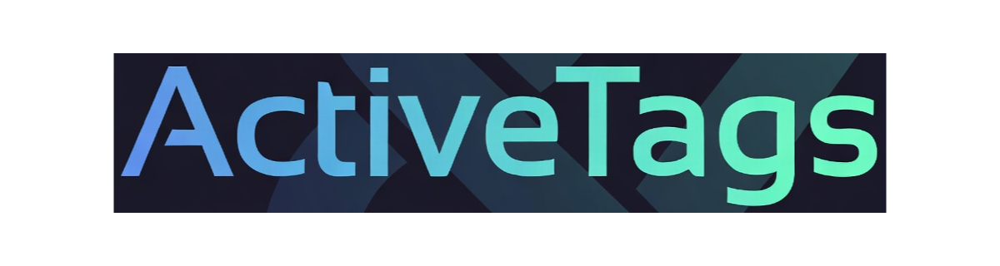

# M7 Projects by `linearblade`

Low-level JavaScript primitives and systems tooling built from 25+ years of production work.

## Start Here

- Business profile: [ABOUT.md](./ABOUT.md)
- Full repository catalog (language-first): [PROJECTS.md](./PROJECTS.md)
- Dedicated project pages: [M7-JS-LIB.md](./M7-JS-LIB.md), [SIGLATCH.md](./SIGLATCH.md)
- Core foundation: [`m7-js-lib`](https://github.com/linearblade/m7-js-lib)
- Showcase runtime: [`m7-js-lib-app-active-tags`](https://github.com/linearblade/m7-js-lib-app-active-tags)

## Current Projects

### ActiveTags & M7-JS Ecosystem

Deterministic DOM workflow orchestration and modular runtime architecture for building interactive browser apps without hard framework lock-in.

### Siglatch

Security-first C daemon for cryptographically authenticated control and signaling over UDP in low-footprint, high-control operating environments.

## Connect

- GitHub: [github.com/linearblade](https://github.com/linearblade)
- X: [@thegrimscalper](https://x.com/thegrimscalper)
- Website: [m7.org](https://m7.org)

> Tools should disappear into the work, not fight for attention.
